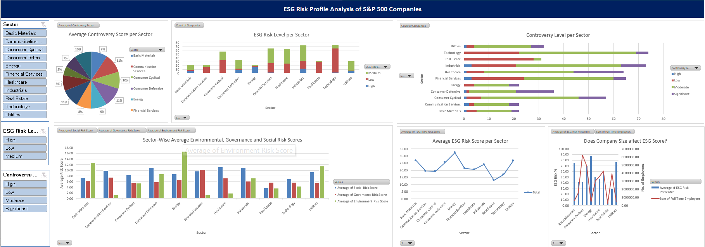

# ESG Risk Analysis and Predictive Modeling on S&P 500 Companies

This project involves an end-to-end analysis of Environmental, Social, and Governance (ESG) risk data for S&P 500 companies. The goal is to extract actionable insights by segmenting companies based on ESG scores, analyzing sectoral risk patterns, identifying potential outliers, and applying predictive models. The findings are summarized in both Jupyter Notebooks and an interactive Excel dashboard.

## 📊 Project Highlights

- Cleaned and preprocessed ESG dataset containing scores across multiple risk dimensions.
- Performed in-depth Exploratory Data Analysis (EDA) to uncover patterns and outliers.
- Segmented companies using hierarchical clustering based on ESG scores.
- Applied classification and regression models using Random Forest to:
  - Predict ESG Risk Levels.
  - Estimate Total ESG Risk Scores.
  - Attempted prediction of Controversy Scores.
- Developed a detailed Excel dashboard to visually represent risk distributions across sectors.

## 🛠️ Tools and Libraries Used

- **Python**: pandas, numpy, matplotlib, seaborn, scikit-learn
- **Excel**: Pivot tables, charts, slicers, stacked bar charts, pie and line graphs
- **Jupyter Notebook**: For step-by-step data analysis and modeling

## 💡 Key Insights

- Certain sectors like **Energy** and **Utilities** show significantly higher ESG risk scores.
- Companies with higher **full-time employees** did not necessarily have lower ESG risks.
- Hierarchical clustering revealed distinct ESG profiles across sectors.
- The Excel dashboard enhances interpretability for non-technical stakeholders.
